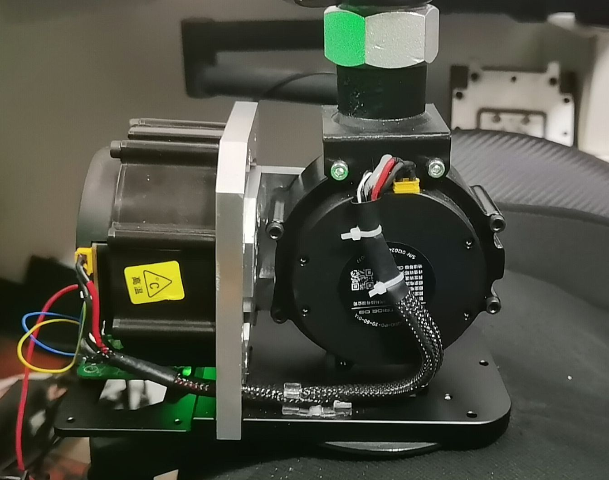
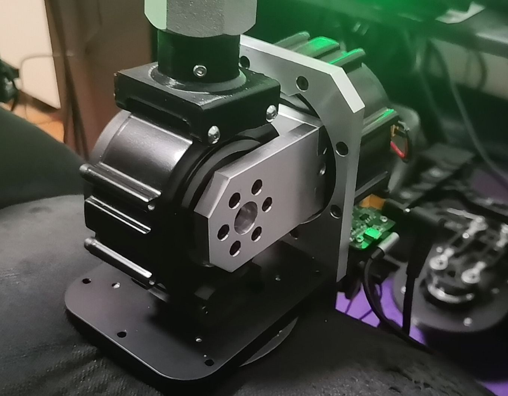
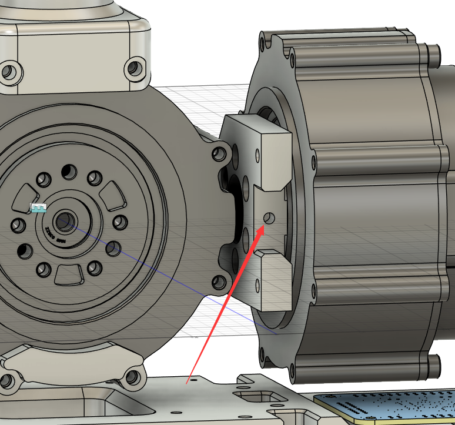
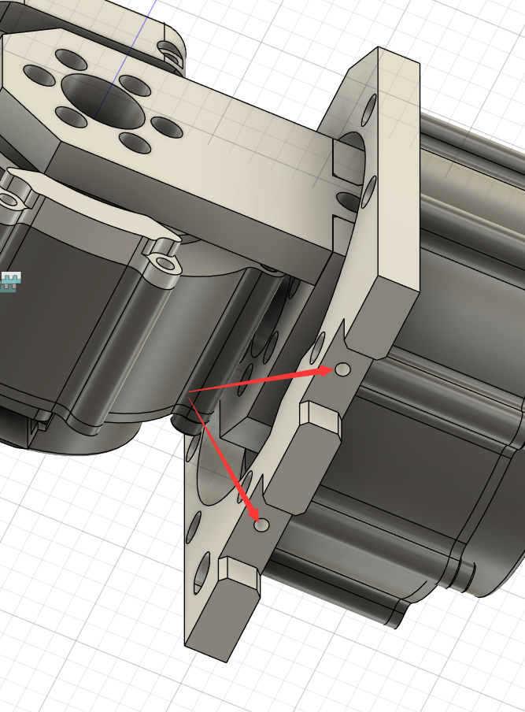
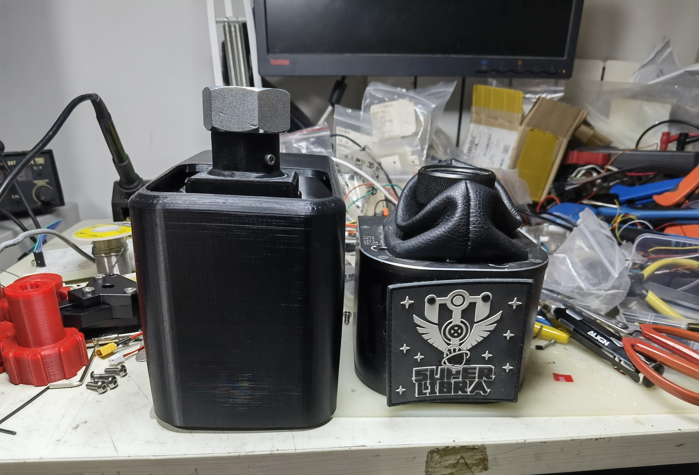
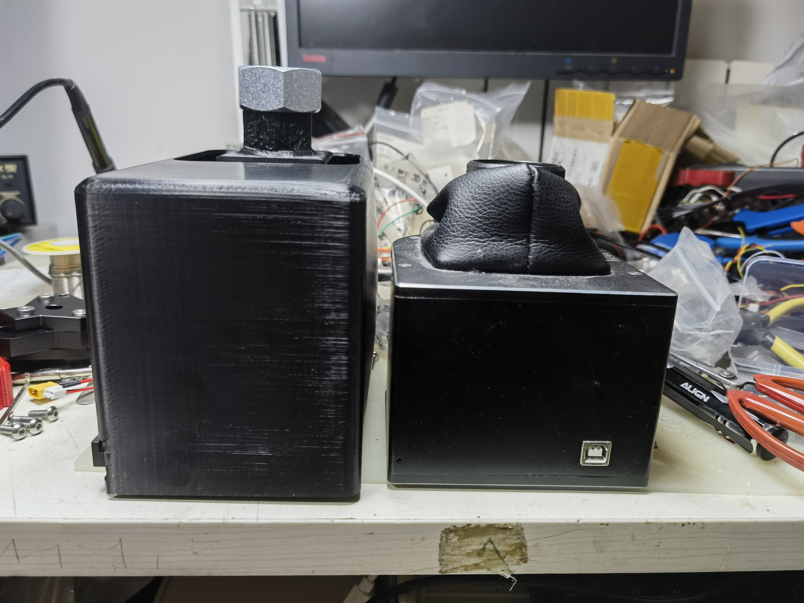
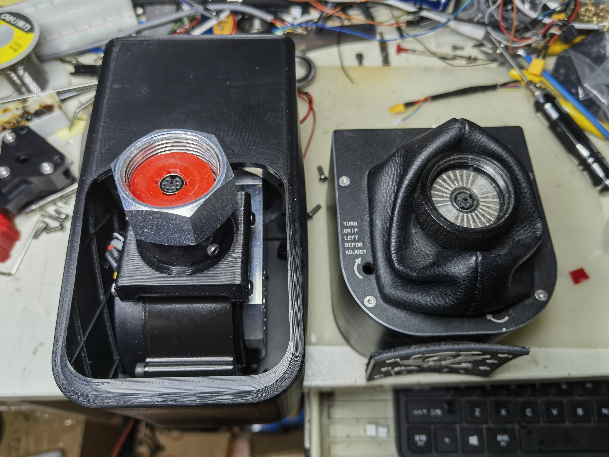
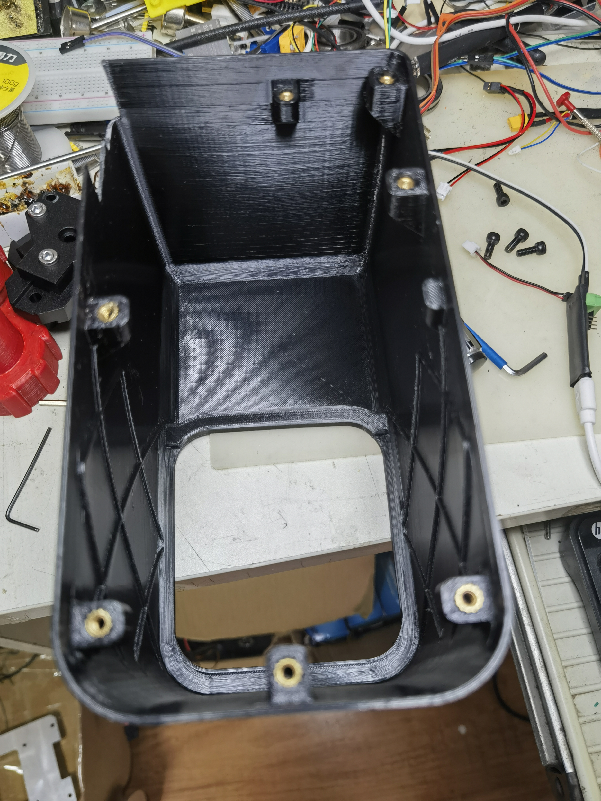
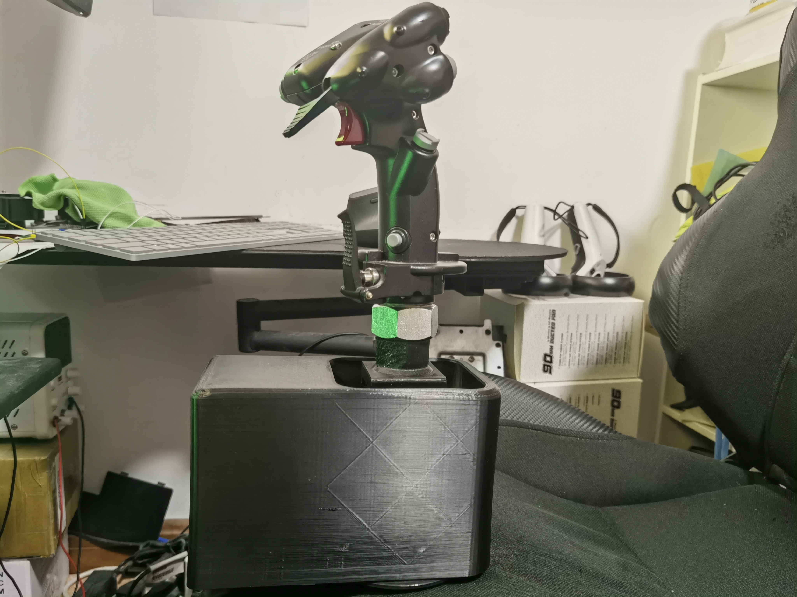

# FFB_Base_vs_Robs03使用灵足03电机的FFB底座

灵足03电机额定扭矩20nm，峰值60nm，非常够劲，即使加上25cm延长杆，峰值也能达到3kg杆力。
考虑到电机力矩较大，主要结构件使用铝合金CNC加工，为了满足<a href="https://gy2025.com/#/home/proofing">铨洲</a>打样的要求，把结构件拆成了4个单独的件。改了两个版本，目前已经用了半个多月了，结构基本上没啥问题，CNC加工成本大概100出头。

需要注意一下，因为铨洲CNC 6.8打样还不支持侧孔，所以打样的时候需要把下面图上的3个孔去掉，回来以后手工打孔攻丝（M4）

其余需要攻丝的孔都按铨洲攻丝的要求画的，可以充分利用铨洲每个件免费攻丝8个孔的便宜。
另外画了一外壳，装上以后宽度比成都造天秤座还窄一点。不过感觉太丑了，先不放上来了，等我再改改。

